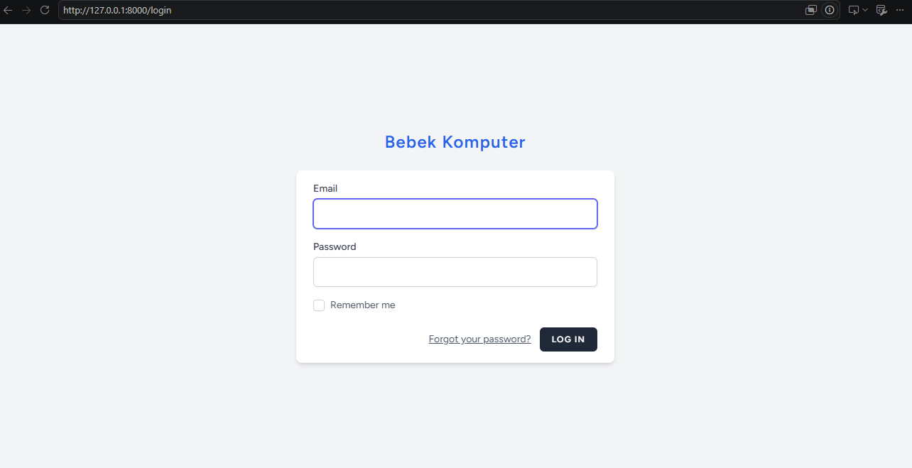
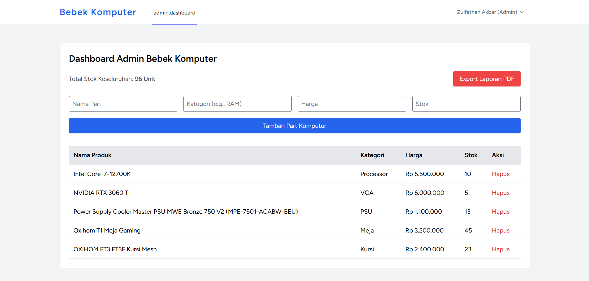
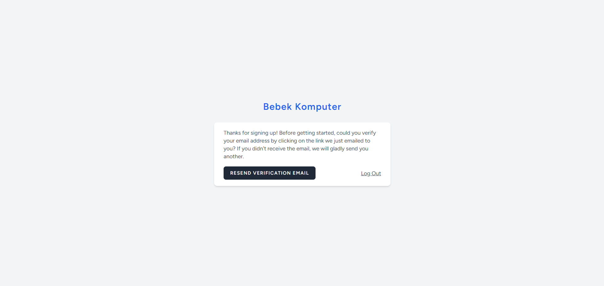
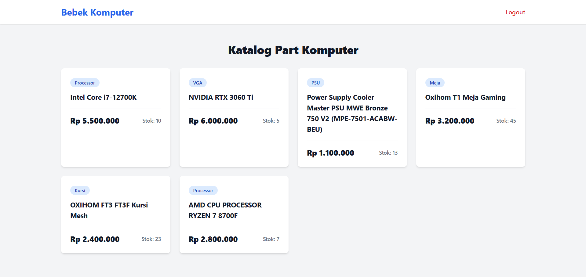
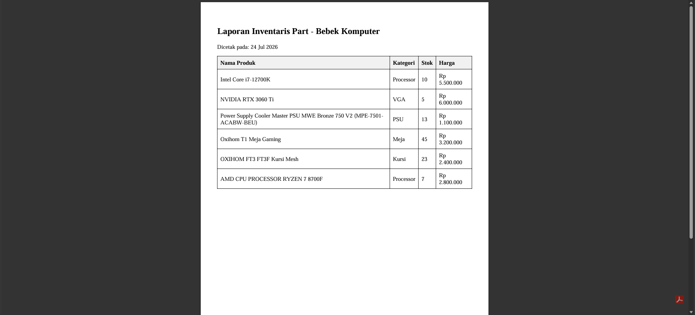
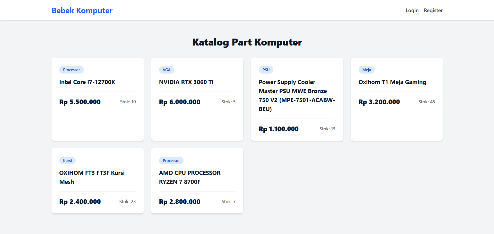
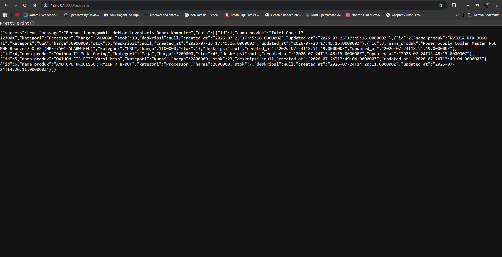

# 🦆 Bebek Komputer - E-Commerce Part Komputer

Aplikasi e-commerce penjualan part komputer yang dibangun menggunakan framework Laravel. Proyek ini dikembangkan untuk memenuhi Ujian Akhir Semester (UAS) mata kuliah Pemrograman Web Lanjut.

Aplikasi ini melingkupi sistem inventaris barang, pemisahan hak akses (Admin dan Pembeli), serta fitur cetak laporan stok barang.

---

## 👨‍💻 Identitas Pengembang
- **Nama**: Zulfathan Akbar
- **NIM**: 230170200
- **Mata Kuliah**: Pemrograman Web Lanjut

---

## 🛠️ Teknologi yang Digunakan
- **Framework:** Laravel 11.x
- **Frontend:** Tailwind CSS & Blade Templating
- **Authentication:** Laravel Breeze (dengan Verifikasi Email)
- **Database:** MySQL
- **Export Laporan:** Barryvdh/Laravel-DomPDF

---

## 🔑 Akun Demo
Gunakan akun berikut untuk menguji coba fitur pembatasan hak akses pada aplikasi:

**Akun Admin (Full Access Dashboard & CRUD)**
- **Email:** admin@bebekkomputer.com
- **Password:** password123

**Akun User / Pembeli (Hanya Katalog)**
- **Email:** user@bebekkomputer.com
- **Password:** password123

---

## 🚀 Cara Instalasi dan Menjalankan Aplikasi

Ikuti langkah-langkah berikut untuk menjalankan aplikasi di server lokal (localhost):

1. **Clone repository ini**
   ```bash
   git clone 
   cd bebek-komputer

## Install semua dependensi PHP dan Node.js

Bash
composer install
npm install
Konfigurasi Environment
Salin file konfigurasi bawaan dan sesuaikan dengan database lokal Anda.

Bash
cp .env.example .env
php artisan key:generate
Buka file .env, lalu atur DB_DATABASE=bebek_komputer (pastikan Anda sudah membuat database kosong dengan nama tersebut di MySQL).
Untuk simulasi verifikasi email, pastikan MAIL_MAILER=log.

Jalankan Migrasi dan Seeder (Untuk Data Awal)

Bash
php artisan migrate --seed
Kompilasi Asset Frontend & Jalankan Server Lokal
Buka dua terminal terpisah dan jalankan kedua perintah ini:

Bash
npm run dev
php artisan serve
Aplikasi sekarang dapat diakses melalui browser di http://127.0.0.1:8000.

## 📸 Dokumentasi Fitur Aplikasi
Berikut adalah bukti tangkapan layar (screenshot) bahwa seluruh fitur wajib telah berjalan dengan baik:

### 1. Halaman Login / Autentikasi
Berikut adalah tampilan halaman login web Bebek Komputer:


### 2. Dashboard & CRUD Part Komputer
Berikut adalah halaman pengelola untuk menambah dan menghapus barang:
 

### 3. Verifikasi Email (Proteksi Akses)
Berikut adalah peringatan wajib verifikasi email bagi pengguna baru sebelum dapat mengakses sistem:


### 4. Pemisahan Hak Akses (View User)
Berikut adalah halaman katalog utama untuk berbelanja yang dikhususkan bagi pelanggan biasa:


### 5. Hasil Export Laporan PDF
Berikut adalah bukti dokumen hasil unduhan laporan inventaris barang dalam format PDF:


### 6. Tampilan Responsive (Mobile Friendly)
Berikut adalah antarmuka web yang menyesuaikan secara otomatis saat dibuka menggunakan layar HP:


### 7. REST API (Pengujian Postman)
Berikut adalah bukti pengujian rute endpoint API pemanggilan data menggunakan aplikasi Postman:
